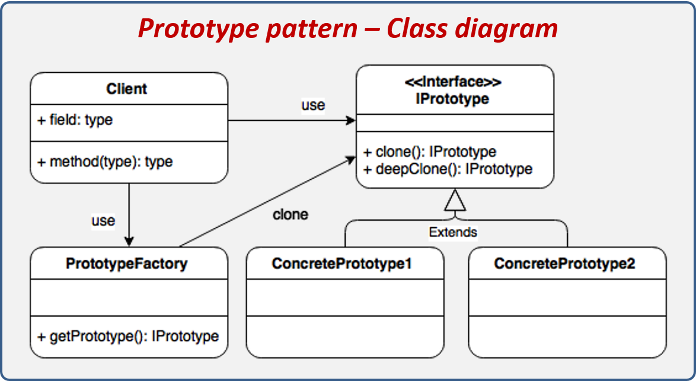
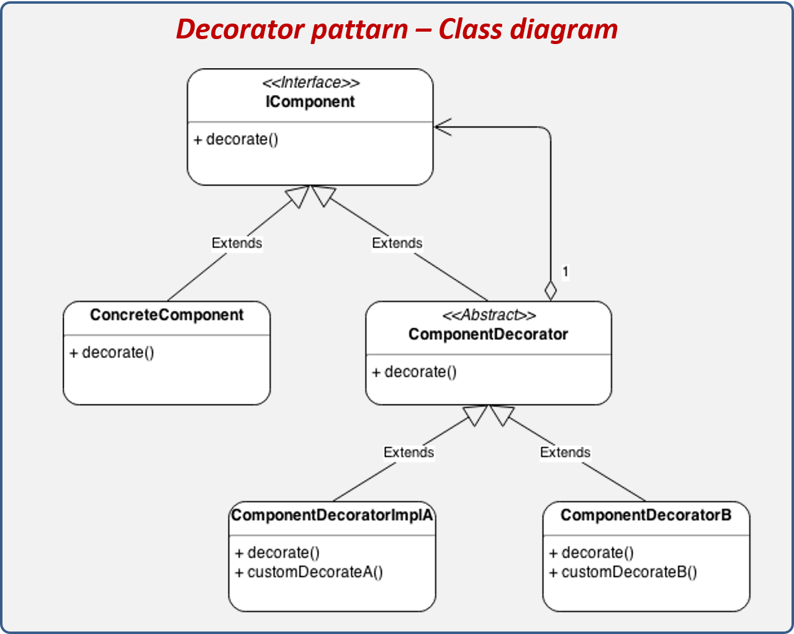
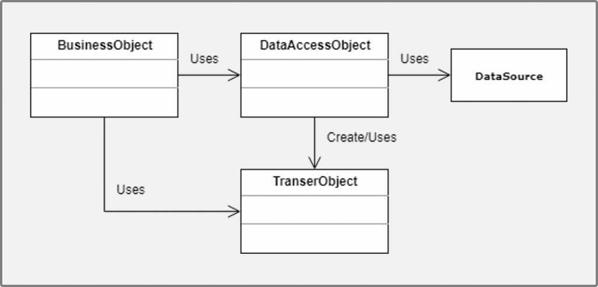

<h1>¿Qué es un patrón?</h1>

Es una solución estandarizada el cual abarca varios conceptos para la reutilización y sostenimiento del código, todo patrón puede ser útil en ciertos casos pero puede tener ventajas y también sus desventajas.

Su estructura se basa por categorías las cuales son: Creacional, Estructural y de comportamiento.

<h2>Tipos de patrones</h2>
<h3>Creacionales</h3>

Inicialización y configuración de objetos.

<h3>Estructurales</h3>

Separa la interfaz de la implementación, se encarga de cómo agrupar las clases y los objetos.

<h3>Comportamiento</h3>

Describe los objetos y clases que están implicados y a su vez recibe como están comunicados entre ellos.

<h1>Singleton</h1>

Tener una única instancia de una clase durante la realización de la aplicación.
La ventaja de utilizar singleton es en el rendimiento específicamente en la memoria,su desventaja es que no podemos abusar de él, ya que en alguna momento se necesitara cambiar de instancia.

<h1>Factory</h1>

Crea una instancia de varias clases derivadas,facilita una interfaz que permite crear objetos en superclases, y a la vez le permite a estas alterar el tipo de objetos que se van a crear.

<h1>Abstract factory</h1>

Crea una instancia de varias familias de clases,Se utiliza cuando en el código se emplea en varias familias de productos relacionadas las cuales no queremos que dependan de las clases concretas de los productos, su primer paso es que la interfaz se encarga de definir la estructura de los objetos que van a crear las familias, luego las clases que van a adquirir el Abstract Product para que se pueda implementar las familias a objetos específicos, después el concrete Factory es el que representa las creaciones específicas que nos servirán para poder crear las instancias de clases de la familia y para finalizar, definimos la estructura de estas creaciones las cuales nos proporcionar un método para cada una de las clases de la familia.

<h1>Prototype</h1>

Es una instancia completamente inicializada que puede ser copiada o clonada, nos permite copiar objetos existentes sin necesidad de que el código sea dependiente de las clases que contenga,Se utiliza normalmente cuando no queremos que el código dependa de las clases específicas de objetos que se necesite copiar.

<h1>Facade</h1>

Promueve la estructuración de un entorno de programación, minimiza la complejidad de sus divisiones en los subsistemas, así mismo reduciendo las comunicaciones y las dependencias existentes entre estos. Se encarga de definir un objeto de (fachada) el cual hace uso de una interfaz universal para las interfaces del subsistema, además puede realizar una serie de funciones adicionales antes y después de haber generado una solicitud a nuestro cliente.

<h1>Decorator</h1>

Añade responsabilidades a los objetos de forma dinámica, el cual permite añadir funcionalidades dentro de objetos los cuales estarán dentro de otros objetos encapsulados especialmente,estos contienen a su vez estas funcionalidades.

<h1>Proxy</h1>

Un objeto que representa a otro objeto,facilita un sustituto para otro objeto facilitando al objeto el poder hacer algo tanto antes como después de que la solicitud llegue al objeto original, su estructura se basa en La interfaz de servicio que pueda encubrirse como si fuera un objeto de servicio, el servicio es la clase que proporciona la lógica del negocio útil y por ultimo esta la clase proxy que al finalizar su proceso genera una solicitud al objeto de servicio. 

<h1>Command</h1>

Encapsular una solicitud de comando como un objeto,permite que los clientes se parametrice con diferentes solicitudes,podemos utilizar a un restaurante como ejemplo: El mesero o mesera toma una orden o comando de un cliente y encapsula esa orden escribiéndola, Luego, la orden se pone en cola para un cocinero de orden corta.Tenga en cuenta que el panel de "verificaciones" que utiliza cada mesero no depende del menú y, por lo tanto, pueden admitir comandos para cocinar muchos artículos diferentes.

<h1>Memento</h1>

Capturar y restaurar el estado interno de un objeto le permite almacenar y restaurar estados anteriores de un objeto sin exponer su información de implementación.
Este patrón se usa cuando se desea crear instantáneas del estado actual de un objeto para restaurar el objeto a un estado anterior.
Su estructura se basa en esta clase nativa, que tiene la capacidad de crear instantáneas de su estado y restaurarlo usando instantáneas cuando sea necesario, Memoria, que es un objeto que actúa como una instantánea de su estado original. , el controlador contiene información sobre cuándo y por qué debe restaurar el estado original Y finalmente se realiza la implementación, primero la clase de memoria debe anidarse dentro del original, dándole acceso a los campos y métodos de la clase de memoria original, en cuyo caso el controlador tiene acceso limitado a estos campos y métodos, lo que a su vez permite que los objetos de memoria se almacenen sin cambiar su estado.

<h1>Observer</h1>

Una forma de notificar el cambio a un número de clases, Este es un patrón de diseño que le permite definir dependencias de tipo (1:M) entre objetos, creando de tal manera que cuando un objeto cambia su estado, todas sus dependencias son notificadas. Su estructura se basa en: un tema que proporciona una interfaz para agregar y quitar observadores. Un observador define un método que utiliza un objeto para informar cambios en su estado. Un objeto específico. Mantiene un estado útil para ciertos observadores y también les notifica cuando cambia su estado. Y los observadores especiales que contienen una referencia a un objeto en particular para implementar la interfaz de actualización almacenan brevemente información observable sobre ese objeto para que pueda realizar cambios en él. Esto se usa típicamente cuando los cambios de estado de un objeto se deben pasar a otros objetos desconocidos en el grupo.

<h1>Strategy</h1>

Encapsula un algoritmo dentro de una clase, Es un patrón de diseño que se puede usar para definir  una familia de algoritmos, lo que facilita su separación en clases separadas para crear objetos intercambiables. Su estructura es la siguiente: Clase de contexto, esta clase es la que tiene una referencia a alguna estrategia específica, por lo que solo puede comunicarse con este objeto a través de la interfaz de estrategia. La interfaz de estrategia puede declarar un método que utiliza la clase de contexto para implementar la estrategia. Estrategias específicas. Estos son los que implementan diferentes variaciones del algoritmo  utilizado por la clase de contexto. Y el cliente responsable de crear el objeto de estrategia y luego pasarlo a la clase de contexto para que  la clase de contexto pueda usar un modificador (matriz) que permita a los clientes reemplazar la estrategia  asociada con el contexto (durante el proceso de ejecución).

<h1>Data Access Object</h1>

Nos suministra una interfaz entre el dispositivo de almacenamiento de datos y la aplicación, este patrón se utiliza gracias a su fácil implementación, nos permite separar en su totalidad la lógica de acceso a datos de objetos de negocio.
Su estructura se conforma de Business Object, el cual es que representa un objeto con su lógica de negocio. Data Access Object, este representa una capa de acceso a los datos que la fuente oculta y también lo detalles para la recuperación de datos. Transfer Object, este implementa el patrón de (DTO) que cumple la función de transmitir la información entre DAO y Business Service. Y por último tenemos al DataSource, el cual es el que representa de una manera abstracta la fuente de datos.

<h1>Dependency injection</h1>

Es un patrón de diseño que se encarga de proporcionar objetos a una clase sin  que la clase tenga que hacerlo. En pocas palabras, esta plantilla es responsable de crear  instancias de un componente y luego añadirlo dentro de otro.

<h1>Model View Controller</h1>

Es un marco de trabajo creado por Microsoft y una comunidad de desarrolladores, la cual permite crear páginas web implementando arquitectura (Modelo-Vista-Controlador), este patrón nos ayuda a organizar y estructurar todos los componentes de un software.

